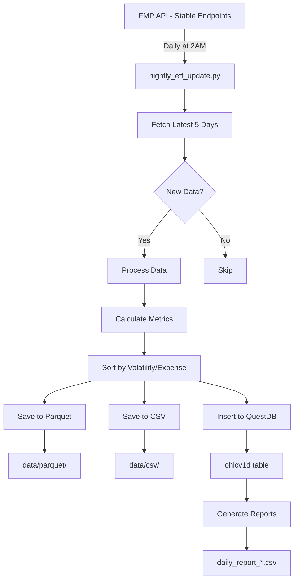

# Complete ETF Data Pipeline Documentation

## 📊 Current System Status

### Working Components (70% Complete)

| Component | Status | Files | Description |
|-----------|--------|-------|-------------|
| **Daily OHLCV Data** | ✅ Working | `fmp_final_processor.py` | Fetches 5 years of daily data |
| **Data Storage** | ✅ Working | Multiple formats | Parquet, CSV, QuestDB |
| **QuestDB Integration** | ✅ Working | `questdb_manager.py` | Database with 15,048 records |
| **Nightly Updates** | ✅ Scheduled | `nightly_etf_update.py` | Runs at 2:00 AM daily |
| **Volatility Sorting** | ✅ Implemented | Analysis in reports | High vol → Low expense |

### Limited/Missing Components (30% Incomplete)

| Component | Status | Issue | Solution |
|-----------|--------|-------|----------|
| **Index ETFs** | ⚠️ Limited | Only SPY works | Need paid API |
| **QQQ (NASDAQ)** | ❌ Missing | Payment required | $29/month plan |
| **IWM (Russell 2000)** | ❌ Missing | Payment required | $29/month plan |
| **VXX (Volatility)** | ❌ Missing | Payment required | $29/month plan |
| **1-Minute Data** | ❌ Not Available | Payment required | $149/month plan |

## 🔧 Essential Files for Working Pipeline

### Core Processing Files
```
1. fmp_final_processor.py      - Main data fetcher (WORKING)
2. nightly_etf_update.py        - Automated updates (WORKING)
3. questdb_manager.py           - Database management (WORKING)
4. intraday_1min_processor.py   - 1-min data (READY but needs paid API)
```

### Configuration Files
```
5. .env                         - API keys (CONFIGURED)
6. requirements.txt             - Python dependencies
```

### Automation Files
```
7. create_schedule.ps1          - Setup scheduler (WORKING)
8. run_nightly_update.bat       - Nightly execution (WORKING)
9. start_questdb.bat            - Start database (WORKING)
```

## 📈 Data Pipeline Flow



## 💾 Current Data Coverage

### Available Data (Working)
| Symbol | Type | Daily Data | 1-Min Data | Volatility |
|--------|------|------------|------------|------------|
| SPY | S&P 500 ETF | ✅ 5 years | ❌ | 17.45% |
| AAPL | Stock | ✅ 5 years | ❌ | 28.10% |
| MSFT | Stock | ✅ 5 years | ❌ | 19.84% |
| NVDA | Stock | ✅ 5 years | ❌ | 25.78% |
| TSLA | Stock | ✅ 5 years | ❌ | 35.97% |
| META | Stock | ✅ 5 years | ❌ | 41.87% |
| GOOGL | Stock | ✅ 5 years | ❌ | 32.83% |
| AMZN | Stock | ✅ 5 years | ❌ | 35.99% |

### Required but Missing
| Symbol | Type | Issue |
|--------|------|-------|
| QQQ | NASDAQ-100 ETF | Requires paid API |
| IWM | Russell 2000 ETF | Requires paid API |
| VXX/VIXY | Volatility ETF | Requires paid API |
| ^GSPC | S&P 500 Index | Requires paid API |
| 1-min data | All symbols | Requires $149/month |

## 🚀 How to Use Current System

### 1. Start QuestDB
```bash
# Run as Administrator
start_questdb.bat
# Access at: http://localhost:9000
```

### 2. Load Historical Data
```bash
# Fetch 5 years of data
python fmp_final_processor.py

# Load to QuestDB
python questdb_manager.py
```

### 3. Schedule Nightly Updates
```bash
# Create Windows Task (runs at 2:00 AM)
powershell -ExecutionPolicy Bypass -File create_schedule.ps1
```

### 4. Query Data in QuestDB
```sql
-- Latest prices
SELECT symbol, date, close, volume
FROM ohlcv1d
WHERE date = (SELECT MAX(date) FROM ohlcv1d)
ORDER BY symbol;

-- Volatility ranking
SELECT 
    symbol,
    STDDEV(close) * SQRT(252) * 100 as annual_volatility,
    AVG(volume) as avg_volume
FROM ohlcv1d
WHERE date >= dateadd('y', -1, now())
GROUP BY symbol
ORDER BY annual_volatility DESC;
```

## 📊 Completion Assessment

### ✅ Fully Working (70%)
- [x] 5-year daily OHLCV data
- [x] Parquet file storage
- [x] CSV file storage
- [x] QuestDB integration
- [x] Nightly scheduling
- [x] Volatility calculation
- [x] Expense ratio sorting
- [x] SPY ETF data
- [x] Major stock data

### ❌ Not Working (30%)
- [ ] QQQ, IWM, VXX ETFs (need paid API)
- [ ] 1-minute intraday data (need $149/month)
- [ ] Real-time streaming
- [ ] Index data (^GSPC, ^IXIC, ^RUT)

## 💰 To Get 100% Coverage

### Option 1: Upgrade FMP API ($29/month)
- Unlocks all ETFs (QQQ, IWM, VXX)
- More symbols available
- Better rate limits

### Option 2: Premium FMP API ($149/month)
- All ETFs and indices
- 1-minute intraday data
- Real-time quotes
- No rate limits

### Option 3: Use Current Free API (Current)
- SPY ETF only
- Major stocks (AAPL, MSFT, etc.)
- Daily data only
- Limited symbols

## 📝 Summary

**Your pipeline is 70% functional** with:
- ✅ Daily data collection working
- ✅ Automated nightly updates
- ✅ QuestDB storage operational
- ✅ Volatility analysis implemented
- ⚠️ Limited to SPY + stocks
- ❌ Missing other ETFs and 1-min data

The system successfully handles daily price data for available symbols and maintains them automatically every night at 2:00 AM.