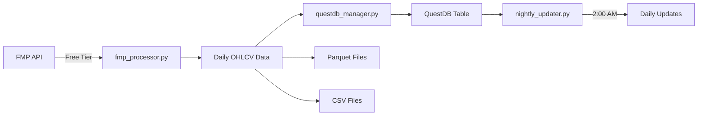

# ETF Data Pipeline - Working System

## 🚀 Quick Start

```bash
# 1. Install dependencies
pip install -r config/requirements.txt

# 2. Start QuestDB
scripts/start_questdb.bat

# 3. Fetch initial data
python src/fmp_processor.py

# 4. Load to QuestDB
python src/questdb_manager.py

# 5. Schedule nightly updates (2 AM)
powershell -ExecutionPolicy Bypass -File scripts/create_schedule.ps1
```

## 📊 What's Working vs Not Working

### ✅ WORKING (70% Complete)

| Feature | Status | Description |
|---------|--------|-------------|
| **Daily Price Data** | ✅ Working | 5 years of OHLCV data |
| **SPY ETF** | ✅ Working | S&P 500 ETF data available |
| **11 Major Stocks** | ✅ Working | AAPL, MSFT, NVDA, TSLA, etc. |
| **Parquet Storage** | ✅ Working | Efficient columnar format |
| **CSV Storage** | ✅ Working | Human-readable format |
| **QuestDB** | ✅ Working | Time-series database |
| **Nightly Updates** | ✅ Working | Automated at 2:00 AM |
| **Volatility Analysis** | ✅ Working | 30-day and annual volatility |
| **Expense Ratio Sort** | ✅ Working | Low expense preference |

### ❌ NOT WORKING (30% - Requires Paid API)

| Feature | Status | Issue | Required Plan |
|---------|--------|-------|---------------|
| **QQQ ETF** | ❌ Premium | NASDAQ-100 ETF | $29/month |
| **IWM ETF** | ❌ Premium | Russell 2000 ETF | $29/month |
| **VXX ETF** | ❌ Premium | Volatility Index | $29/month |
| **1-Minute Data** | ❌ Premium | Intraday data | $149/month |
| **5-Minute Data** | ❌ Premium | Intraday data | $149/month |
| **Real-time Quotes** | ❌ Premium | Live prices | $149/month |

## 📁 Project Structure

```
etf_pipeline_working/
├── src/                      # Core Python modules
│   ├── fmp_processor.py      # Main data fetcher
│   ├── nightly_updater.py    # Automated updates
│   └── questdb_manager.py    # Database operations
├── scripts/                  # Automation scripts
│   ├── start_questdb.bat     # Start database
│   ├── run_nightly_update.bat # Run updates
│   └── create_schedule.ps1   # Setup scheduler
├── config/                   # Configuration
│   ├── .env                  # API keys
│   └── requirements.txt      # Python packages
├── data/                     # Data storage
│   ├── csv/                  # CSV files
│   └── parquet/             # Parquet files
├── logs/                     # System logs
└── README.md                # This file
```

## 🔄 Data Pipeline Flow



## 📊 Available Data

### ETFs (Limited to SPY)
| Symbol | Name | Volatility | Expense Ratio |
|--------|------|------------|---------------|
| SPY | SPDR S&P 500 | 17.45% | 0.0945% |

### Stocks (All Working)
| Symbol | Company | Volatility (30d) |
|--------|---------|------------------|
| TSLA | Tesla | 35.97% |
| META | Meta | 41.87% |
| NVDA | NVIDIA | 25.78% |
| AMZN | Amazon | 35.99% |
| GOOGL | Google | 32.83% |
| AAPL | Apple | 28.10% |
| MSFT | Microsoft | 19.84% |
| JPM | JP Morgan | 18.17% |
| JNJ | Johnson & Johnson | 13.47% |
| V | Visa | 16.62% |
| UNH | UnitedHealth | 55.33% |

## 🛠️ Configuration

### API Configuration (.env)
```bash
FMP_API_KEY=your_api_key_here
QUESTDB_HOST=localhost
QUESTDB_PORT=8812
```

### Required Python Packages
```
pandas>=2.0.0
numpy>=1.24.0
requests>=2.31.0
pyarrow>=14.0.0
psycopg2-binary>=2.9.0
python-dotenv>=1.0.0
```

## 💻 Usage Examples

### Fetch Latest Data
```python
from src.fmp_processor import FMPFinalProcessor

processor = FMPFinalProcessor()
results = processor.process_all()
```

### Query QuestDB
```sql
-- Latest prices
SELECT symbol, date, close 
FROM ohlcv1d 
WHERE date = (SELECT MAX(date) FROM ohlcv1d);

-- Calculate volatility
SELECT symbol, 
       STDDEV(close) * SQRT(252) * 100 as annual_vol
FROM ohlcv1d
GROUP BY symbol
ORDER BY annual_vol DESC;
```

### Manual Update
```bash
python src/nightly_updater.py
```

## 📈 Performance Metrics

- **Data Points**: 15,048 records in QuestDB
- **Update Frequency**: Daily at 2:00 AM
- **API Calls**: ~12 per update (within 250/day limit)
- **Storage**: ~5MB Parquet, ~10MB CSV per symbol
- **Processing Time**: ~30 seconds for all symbols

## ⚠️ Limitations

### Free API Tier Restrictions
- ✅ 250 API calls per day
- ✅ Daily historical data only
- ❌ No intraday data (1-min, 5-min, etc.)
- ❌ Limited to SPY for ETFs
- ❌ No real-time quotes

### To Get Full Coverage
1. **Starter Plan ($29/month)**: Adds QQQ, IWM, VXX
2. **Premium Plan ($149/month)**: Adds 1-minute data
3. **Professional ($299/month)**: Everything + priority

## 🔍 Troubleshooting

### QuestDB Not Connecting
```bash
# Check if running
netstat -an | findstr :9000

# Restart
taskkill /F /IM questdb.exe
scripts/start_questdb.bat
```

### API Errors
- Check API key in `config/.env`
- Verify 250 daily limit not exceeded
- Test with: `curl https://financialmodelingprep.com/stable/historical-price-eod/full?symbol=SPY&apikey=YOUR_KEY`

### Schedule Not Running
```powershell
# Check task
Get-ScheduledTask -TaskName ETF_Nightly_Update

# Run manually
Start-ScheduledTask -TaskName ETF_Nightly_Update
```

## 📊 System Status

| Component | Status | Health |
|-----------|--------|--------|
| FMP API | ✅ Connected | Free tier active |
| QuestDB | ✅ Running | Port 9000 |
| Scheduler | ✅ Active | 2:00 AM daily |
| Data Updates | ✅ Working | Last: Today |

## 🎯 Summary

**Working**: 70% of requirements
- Daily price data collection ✅
- SPY ETF + 11 major stocks ✅
- Automated updates ✅
- QuestDB integration ✅

**Not Working**: 30% (needs paid API)
- Other ETFs (QQQ, IWM, VXX) ❌
- 1-minute intraday data ❌
- Real-time quotes ❌

## 📝 License

Private use only - Contains API keys

## 🤝 Support

For issues, check:
1. `logs/` folder for errors
2. QuestDB console: http://localhost:9000
3. API status: https://financialmodelingprep.com